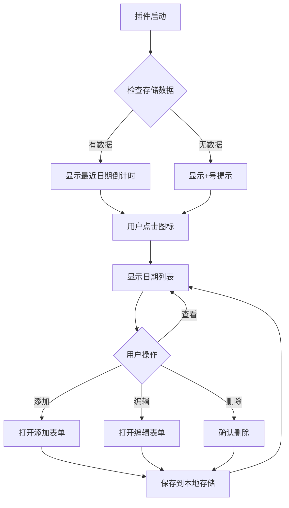

# PRD：浏览器重要日期倒计时插件

## 1. 文档信息

| 字段         | 内容                                                         |
| :----------- | :----------------------------------------------------------- |
| 负责人       | YiM                                                          |
| 状态         | 草稿                                                         |
| 更新时间     | 2024-12-19                                                   |
| 关联问题陈述 | /ideas/browser_countdown_extension_problem_statement.md      |

## 2. 背景与目标 (Background & Goals)

* **项目背景：**
  现代用户面临信息过载和时间管理挑战，传统日历应用过于复杂，容易被忽略。用户需要一个轻量级、随时可见的倒计时工具来跟踪重要日期。

* **要解决的核心问题：**
  用户经常忘记重要日期（生日、纪念日、截止日期等），现有解决方案要么太重，要么太轻，缺乏一个平衡点。

* **项目目标：**
  开发一个浏览器插件，在用户的日常浏览环境中提供静默但有效的倒计时提醒，帮助用户不错过重要时刻。

* **成功指标：**
  - 日活跃用户中，每日主动查看倒计时的比例 > 40%
  - 用户添加第一个日期后7天留存率 > 60%
  - 平均每用户添加的重要日期数量 > 3个

## 3. 用户故事 (User Stories)

| 角色 (Persona) | 想要 (Want) | 目的 (Goal) | 优先级 |
| :------------- | :---------- | :---------- | :----- |
| 职场人士 | 在浏览器工具栏看到项目截止日期倒计时 | 避免错过重要交付 | P0 |
| 学生 | 快速添加考试日期并随时查看剩余天数 | 合理安排复习时间 | P0 |
| 家庭管理者 | 设置家人生日和纪念日提醒 | 维护家庭关系 | P1 |
| 自由职业者 | 跟踪客户付款和交付截止日期 | 避免经济损失 | P1 |

### 详细用户故事

**US-1：快速添加重要日期**
作为职场人士，我想要在2秒内添加一个新的项目截止日期，以便快速记录重要时刻。

**US-2：静默查看倒计时**
作为学生，我想要在浏览网页时随时看到考试剩余天数，以便保持时间意识。

**US-3：个性化显示**
作为家庭管理者，我想要为不同类型的日期设置不同颜色，以便快速识别重要性。

**US-4：隐私保护**
作为所有用户，我想要数据只保存在本地，以便保护个人隐私。

## 4. 功能详述 (Functional Specifications)

### 4.1 浏览器工具栏图标显示

* **逻辑描述：**
  插件图标显示最近一个或最重要日期的倒计时天数。图标为徽章样式，显示剩余天数。

* **页面/组件：**
  - 浏览器工具栏图标（Browser Action）
  - 徽章文本显示剩余天数
  - 图标颜色根据紧急程度变化

* **交互规则：**
  - 当有重要日期时，图标显示剩余天数
  - 当没有日期时，显示"+"符号提示添加
  - 鼠标悬停显示完整日期信息
  - 点击图标打开弹出窗口

* **边界条件：**
  - 剩余天数 > 999天时，显示"999+"
  - 当天就是重要日期时，显示"今天"
  - 过去日期显示"已过期"

### 4.2 弹出窗口日期列表

* **逻辑描述：**
  点击图标后显示所有重要日期的列表，按时间顺序排列，支持快速查看和管理。

* **页面/组件：**
  - 弹出窗口（Popup）
  - 日期列表视图
  - 添加新日期按钮
  - 编辑/删除操作

* **交互规则：**
  - 列表按时间升序排列
  - 每个项目显示：标题、日期、剩余天数、重要性标识
  - 支持滑动删除（移动端）或悬停显示操作按钮
  - 点击项目进入编辑模式

* **边界条件：**
  - 空列表时显示引导添加界面
  - 列表超过10项时支持滚动
  - 编辑时防止重复提交

### 4.3 快速添加新日期

* **逻辑描述：**
  用户通过简单表单快速添加新的重要日期，最少只需输入日期和标题。

* **页面/组件：**
  - 添加日期表单
  - 日期选择器
  - 标题输入框
  - 重要性选择器

* **交互规则：**
  - 默认显示当天日期
  - 支持键盘快捷键（Ctrl+N）快速添加
  - 输入验证：标题不能为空，日期不能为过去
  - 添加后自动返回列表视图

* **边界条件：**
  - 防止重复添加相同日期和标题
  - 处理无效日期输入
  - 网络离线时仍能正常添加（本地存储）

### 4.4 个性化设置

* **逻辑描述：**
  用户可自定义显示样式，包括颜色主题、显示格式等。

* **页面/组件：**
  - 设置页面
  - 主题选择器
  - 显示格式选项
  - 重要性级别配置

* **交互规则：**
  - 提供3-5种预设主题
  - 支持自定义颜色（通过颜色选择器）
  - 实时预览设置效果
  - 设置立即生效

* **边界条件：**
  - 处理无效的颜色值
  - 确保高对比度保证可读性
  - 主题设置持久化存储

## 5. 流程图 (Flowchart)

## 6. 非功能需求 (Non-Functional Requirements)

* **性能：**
  - 插件启动时间 < 500ms
  - 弹出窗口打开时间 < 200ms
  - 内存占用 < 10MB

* **安全：**
  - 所有数据本地存储，不上传云端
  - 防止XSS攻击，所有用户输入进行转义
  - 遵循最小权限原则，只申请必要权限

* **兼容性：**
  - 支持Chrome 88+、Firefox 85+、Edge 88+
  - 支持Windows、macOS、Linux系统
  - 响应式设计，支持不同屏幕尺寸

* **可访问性 (a11y)：**
  - 支持键盘导航
  - 提供高对比度模式
  - 屏幕阅读器兼容
  - 符合WCAG 2.1 AA标准

## 7. 数据埋点 (Data Tracking)

| 页面 | 事件ID (Event ID) | 事件名称       | 触发时机       | 附加参数 |
| :--- | :---------------- | :------------- | :------------- | :------- |
| 工具栏 | badge_display     | 徽章展示       | 倒计时更新时   | days_left, importance |
| 弹出窗 | popup_open        | 弹出窗口打开   | 用户点击图标   | date_count |
| 弹出窗 | date_add          | 添加新日期     | 成功添加日期   | title, importance |
| 弹出窗 | date_edit         | 编辑日期       | 完成编辑       | date_id |
| 弹出窗 | date_delete       | 删除日期       | 确认删除       | date_id |
| 弹出窗 | settings_open     | 打开设置       | 用户点击设置   | - |
| 设置页 | theme_change      | 主题变更       | 用户切换主题   | theme_name |

## 8. 范围边界 (Scope & Non-Goals)

* **本期实现：**
  - 基础倒计时显示功能
  - 日期添加/编辑/删除
  - 本地数据存储
  - 基础个性化设置
  - 浏览器兼容性（Chrome、Firefox）

* **本期不做：**
  - 重复事件支持
  - 云端同步功能
  - 移动端APP
  - 声音/弹窗提醒
  - 团队协作功能
  - 复杂的数据分析
  - 多语言支持（仅中文）

## 9. 待办与疑问 (Open Questions)

* **技术确认：**
  - 是否需要支持Manifest V3的service worker？
  - 本地存储容量限制如何处理？
  - 如何处理浏览器休眠时的倒计时更新？

* **用户体验：**
  - 是否需要支持拖拽排序？
  - 是否应该提供导入/导出功能？
  - 是否需要支持日期分类标签？

* **商业模式：**
  - 完全免费还是需要高级功能付费？
  - 是否需要考虑隐私政策的法律要求？