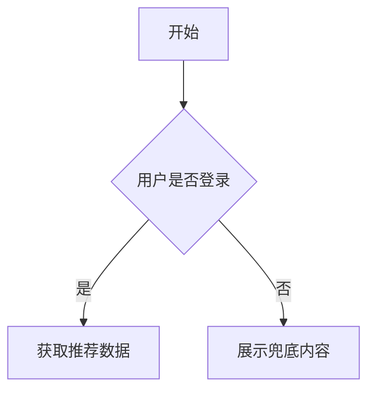

# PRD：[功能名称]

## 1. 文档信息

| 字段         | 内容                                   |
| :----------- | :------------------------------------- |
| 负责人       | YiM                                    |
| 状态         | 草稿                                   |
| 更新时间     | YYYY-MM-DD                             |
| 关联问题陈述 | 链接到 /ideas/problem_statement_xxx.md |

## 2. 背景与目标 (Background & Goals)

> 以下字段可从 Problem Statement 自动填充

* 项目背景：<在此填写>
* 要解决的核心问题：<在此填写>
* 项目目标：<在此填写>
* 成功指标：<在此填写>

## 3. 用户故事 (User Stories)

* 作为 [用户角色]，我想要 [完成某个动作]，以便 [实现某个价值]。

| 角色 (Persona) | 想要 (Want) | 目的 (Goal) | 优先级 |
| :------------- | :---------- | :---------- | :----- |
| <角色A>        | <想要A>     | <目的A>     | P0     |
| <角色B>        | <想要B>     | <目的B>     | P1     |
| <角色C>        | <想要C>     | <目的C>     | P2     |

## 4. 功能详述 (Functional Specifications)

> 详细描述每个 User Story 的实现逻辑、页面流程和边界条件

### 4.1 功能点 A（例如：推荐流展示）

* 逻辑描述：<在此填写>
* 页面/组件：<在此填写>
* 交互规则：<在此填写>
* 边界条件 / 异常状态：<在此填写>

### 4.2 功能点 B（例如：点击跳转）

* 逻辑描述：<在此填写>
* 页面/组件：<在此填写>
* 交互规则：<在此填写>
* 边界条件 / 异常状态：<在此填写>

## 5. 流程图 (Flowchart)

> 可使用 Mermaid.js 生成

## 6. 非功能需求 (Non-Functional Requirements)

* 性能：例如，页面加载时间 < 1s
* 安全：例如，防止 XSS 攻击
* 兼容性：例如，兼容 Chrome、Safari 最新版
* 可访问性 (a11y)：<在此填写原则或标准>

## 7. 数据埋点 (Data Tracking)

| 页面 | 事件ID (Event ID) | 事件名称       | 触发时机       | 附加参数 |
| :--- | :---------------- | :------------- | :------------- | :------- |
| 首页 | view_feed         | 瀑布流曝光     | 瀑布流组件加载 | user_id  |
| 首页 | click_feed_item   | 点击瀑布流卡片 | 用户点击卡片   | item_id  |

## 8. 范围边界 (Scope & Non-Goals)

> 以下内容可从 Problem Statement 自动填充

* 本期实现：<在此填写>
* 本期不做：<在此填写>

## 9. 待办与疑问 (Open Questions)

* 需要和法务确认的问题：<在此填写>
* 需要和算法确认的问题：<在此填写>
