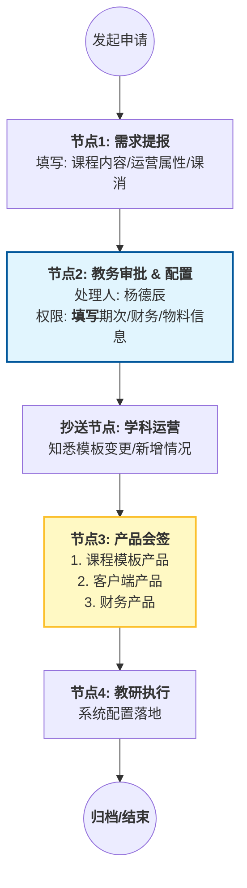

```mermaid
graph TD
    Start((发起申请)) --> Node1[<b>节点1: 需求提报</b><br>填写: 课程内容/运营属性/课消]
    
    Node1 --> Node2[<b>节点2: 教务审批 & 配置</b><br>处理人: 杨德辰<br>权限: <b>填写</b>期次/财务/物料信息]
    
    Node2 --> NodeCC[<b>抄送节点: 学科运营</b><br>知悉模板变更/新增情况]
    
    NodeCC --> Node3[<b>节点3: 产品会签</b><br>1. 课程模板产品<br>2. 客户端产品<br>3. 财务产品]
    
    Node3 --> Node4[<b>节点4: 教研执行</b><br>系统配置落地]
    
    Node4 --> End((<b>归档/结束</b>))

    style Node2 fill:#e1f5fe,stroke:#01579b,stroke-width:2px
    style Node3 fill:#fff9c4,stroke:#fbc02d,stroke-width:2px
```