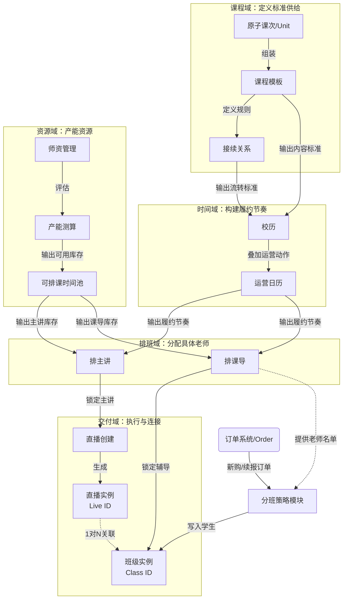

## 一、背景
平台供应链部分，核心系统的结构设计、后期的演进方向规划

## 二、基础定义
#### 2.1、教研模块
* 定位： 供应链的最上游，负责 标准化供给的生产与封装
* 核心职责
  * 模板封装： 将多个Unit按教学逻辑组装成一个课程模板
  * 关键逻辑： 定义该模板的标准属性（如：共16讲、每节课是直播/录播、Unit属性是常规还是阶段评测）
  * 接续关系： 基于模板定义接续关系（如：模板A续报之后可以学习模板B1、B2、B3）
 
#### 2.2、校历模块
* 定位： 履约时间规划，定义每个期次履约的关键节奏
* 核心职责
  * 期次定义： 要开哪些期次、什么时候开
  * 模板挂载： 消费课程模板，将其引入特定期次
  * 标准节奏设定： 设定该期次下的“标准行课规律”（如：9月1日开课，每周五19:00上课）。此阶段不涉及具体老师，只定“坑位”

输入：产品线、节假日、课程模板
输出：年课期次的标准行课节奏：开课日期、续报日期、完课日期、全额退费期

#### 2.3、运营日历
* 定位： 履约的“指挥官”，在标准节奏上叠加“服务增值”。
* 核心职责
  * 个性化动作编排： 在标准校历的基础之上，制定精细化、个性化的运营动作（如：课前30分钟加“课前直播”）
  * SOP制定： 在每结课上，分别需要管理、一线分别做什么动作、关注什么指标/如何监控执行过程

输入：校历
输出：含运营动作的完整待排任务序列

#### 2.4、主讲师资管理
* 定位： 供给侧资源库，负责产能管理（包括<mark>主讲+课导<mark>）
* 核心职责
  * 档案管理： 维护老师基础信息、资质标签等
  * 产品盘点：有能力计算当前、将来任何一段时间的产能供给情况（每个基地、每个语言下的师资分布）
  * 产能测算： 根据老师提交的空闲时间段，结合业务规则（如：最大带班数量），计算出有效的供给能力
  * 库存发布： 将测算后的有效时间转化为每个老师的“可排课时间池”

输出：全局的产能明细、已清洗的老师可用名额

#### 2.5、排班引擎
* 定位： 完成排班模块的具体动作，为每个期次下安排具体的老师
* 核心职责
  * 排班：确认直播间的主讲、录播课班级的老师
  * 名单确认：和一线业务、管理确认排班名单

输入：销量预测/实际订单 + 辅导/主讲老师供给
输出：每个直播间、班级的老师名单、课导/主讲排期表

#### 2.6、分班策略
* 定位：完成订单/线索的分配，分给对应的主讲/课导/班主任
* 核心职责
  * 支持订单按照预期策略精准分配
  * 有一些业务洞察，给业务输入

#### 2.7、直播后台/班级中心
* 定位： 执行层，将业务排期转化为底层实习
* 核心职责
  * 监听与创建： 
    * 一旦课导和时间确定，开始创建班级
    * 一旦主讲和时间确定，开始创建直播间

输入：期次（课程）、开始时间、老师（课导+主讲）
输出：班级id、直播间id

## 三、整体模块交互

## 四、系统时序图

```mermaid
%%{init: { 'theme': 'dark', 'themeVariables': { 
  'primaryColor': '#1f2020',
  'primaryTextColor': '#fff',
  'lineColor': '#d3d3d3',
  'signalColor': '#ffffff',
  'signalTextColor': '#ffffff',
  'loopBkg': '#2d2d2d',
  'noteBkg': '#0f3d6e',
  'noteTextColor': '#fff'
} } }%%

sequenceDiagram
    autonumber
    participant Order as 订单系统 (OrderStream)
    participant Ops as 运营日历 (OpsCal)
    participant Pool as 资源池 (TeacherPool)
    participant MainSch as 排主讲 (MainScheduler)
    participant TutorSch as 排课导 (TutorScheduler)
    participant LiveC as 直播中心 (LiveCenter)
    participant Strat as 分班策略 (StrategyEngine)
    participant DB as 数据库/实例 (DB)

    %% ==========================================
    %% 第一阶段：供给生产 (生产班级与直播间)
    %% ==========================================
    rect rgb(30, 30, 30)
        Note over Order, DB: <b>第一阶段：供给生产 (Supply Production) - "造班级"</b>

        par 双流排班执行
            loop 排主讲 (Main Instructor)
                Ops->>MainSch: 输入履约节奏 (Time + Content)
                Pool->>MainSch: 提供主讲可用库存
                MainSch->>MainSch: 锁定主讲 & 时间槽
                MainSch->>LiveC: 请求创建直播 (LeadID + Time)
                LiveC-->>DB: 生成 LiveInstance (含推流地址)
                DB-->>MainSch: 返回 LiveID
            end

            loop 排课导 (Tutor Class)
                Ops->>TutorSch: 输入履约节奏
                Pool->>TutorSch: 提供课导可用库存
                TutorSch->>TutorSch: 依据预估产能切分班级
                TutorSch->>DB: 生成 ClassInstance (空班级, 绑定TutorID)
                Note right of TutorSch: 此时班级已生成，但学生列表为空
            end
        end

        MainSch->>DB: 广播 LiveID 到关联的 ClassInstances
        Note over DB: 完成 1(Live) 对 N(Class) 的底层绑定
    end

    %% ==========================================
    %% 第二阶段：订单履约 (实时分班落位)
    %% ==========================================
    rect rgb(0, 80, 70)          /* 墨绿底，最高对比 */
        Note over Order, DB: <b>第二阶段：订单履约 (Order Fulfillment) - "装学生"</b>
        
        Order->>Strat: 1. 推送新订单 (StudentID + SKU)
        
        Strat->>DB: 2. 获取候选班级列表 (TutorScheduler产出的底池)
        Strat->>DB: 3. 获取接续关系/锁师规则 (Continuity)
        
        Note right of Strat: 执行策略逻辑：<br/>1. 过滤满员班级<br/>2. 匹配续报原老师<br/>3. 负载均衡/兜底
        
        Strat->>Strat: 确定目标 ClassID
        
        Strat->>DB: 4. 写入学生 (Update ClassInstance)
        Strat->>DB: 5. 扣减班级余量库存
        
        Strat-->>Order: 返回分配成功 (ClassID + TutorInfo)
    end
```

## 五、测试

