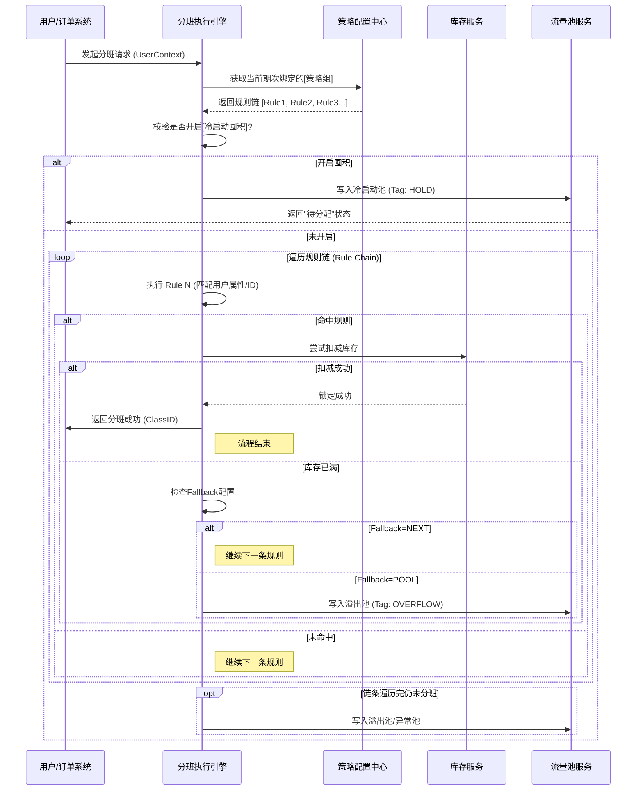

```mermaid
sequenceDiagram
    participant User as 用户/订单系统
    participant Engine as 分班执行引擎
    participant Config as 策略配置中心
    participant Inventory as 库存服务
    participant Pool as 流量池服务

    User->>Engine: 发起分班请求 (UserContext)
    Engine->>Config: 获取当前期次绑定的[策略组]
    Config-->>Engine: 返回规则链 [Rule1, Rule2, Rule3...]
    
    Engine->>Engine: 校验是否开启[冷启动囤积]?
    alt 开启囤积
        Engine->>Pool: 写入冷启动池 (Tag: HOLD)
        Pool-->>User: 返回"待分配"状态
    else 未开启
        loop 遍历规则链 (Rule Chain)
            Engine->>Engine: 执行 Rule N (匹配用户属性/ID)
            alt 命中规则
                Engine->>Inventory: 尝试扣减库存
                alt 扣减成功
                    Inventory-->>Engine: 锁定成功
                    Engine->>User: 返回分班成功 (ClassID)
                    Note right of Engine: 流程结束
                else 库存已满
                    Engine->>Engine: 检查Fallback配置
                    alt Fallback=NEXT
                        Note right of Engine: 继续下一条规则
                    else Fallback=POOL
                        Engine->>Pool: 写入溢出池 (Tag: OVERFLOW)
                    end
                end
            else 未命中
                Note right of Engine: 继续下一条规则
            end
        end
        
        opt 链条遍历完仍未分班
            Engine->>Pool: 写入溢出池/异常池
        end
    end
```