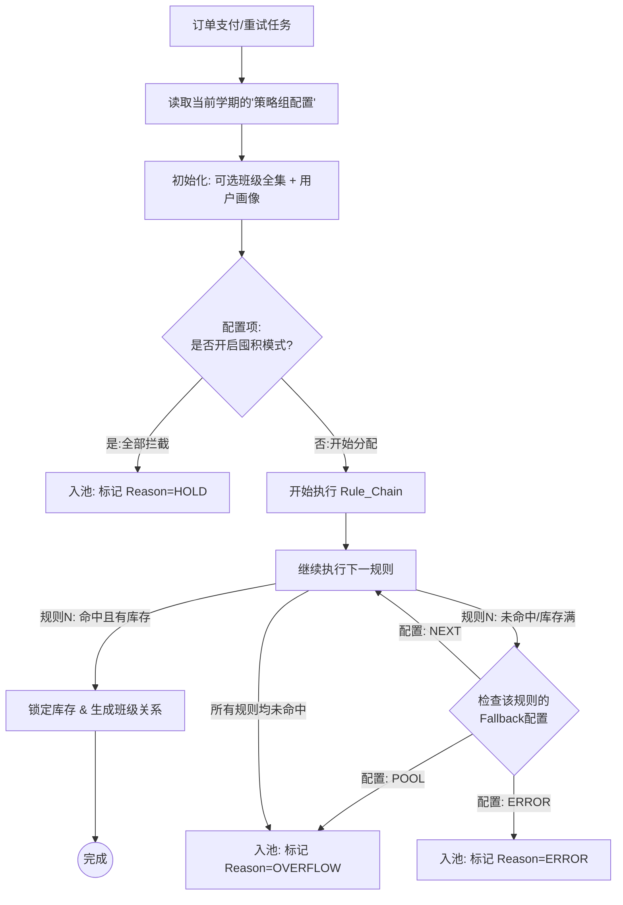

```mermaid
graph TD
    %% 初始化阶段
    Start[订单支付/重试任务] --> LoadConfig[读取当前学期的'策略组配置']
    LoadConfig --> InitContext[初始化: 可选班级全集 + 用户画像]
    
    %% 流量池前置拦截 (冷启动配置)
    InitContext --> CheckHold{配置项:<br/>是否开启囤积模式?}
    CheckHold -- 是:全部拦截 --> PoolEntry_Hold[入池: 标记 Reason=HOLD]
    
    %% 动态规则引擎执行 (核心循环)
    CheckHold -- 否:开始分配 --> ExecuteChain[开始执行 Rule_Chain]
    
    %% 循环遍历配置的规则列表
    ExecuteChain --> LoopRules{遍历规则节点<br/>Rule 1 -> 2 -> ... N}
    
    LoopRules -- 规则N: 命中且有库存 --> DoAssign[锁定库存 & 生成班级关系]
    DoAssign --> End((完成))
    
    %% 规则降级处理
    LoopRules -- 规则N: 未命中/库存满 --> CheckFallback{检查该规则的<br/>Fallback配置}
    CheckFallback -- 配置: NEXT --> LoopRules[继续执行下一规则]
    CheckFallback -- 配置: POOL --> PoolEntry_Overflow[入池: 标记 Reason=OVERFLOW]
    CheckFallback -- 配置: ERROR --> PoolEntry_Error[入池: 标记 Reason=ERROR]
    
    %% 链条跑完仍无结果
    LoopRules -- 所有规则均未命中 --> PoolEntry_Overflow

```

