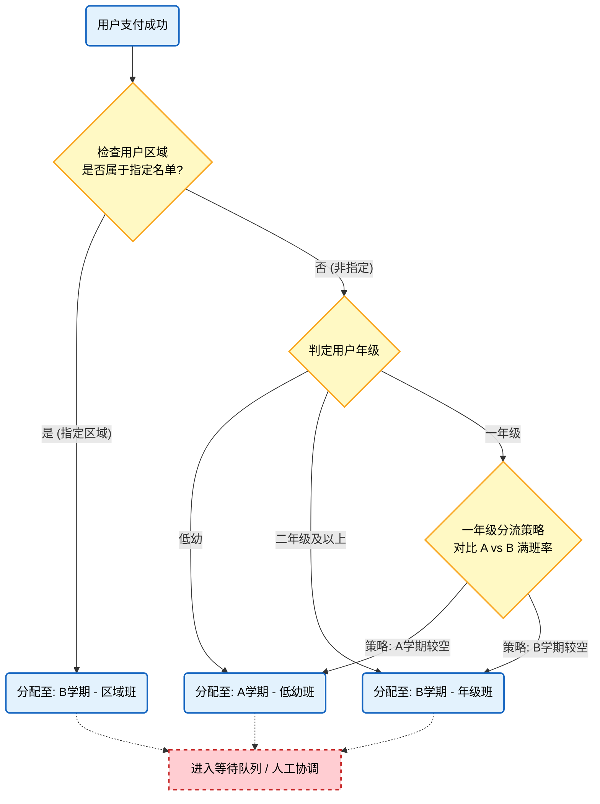
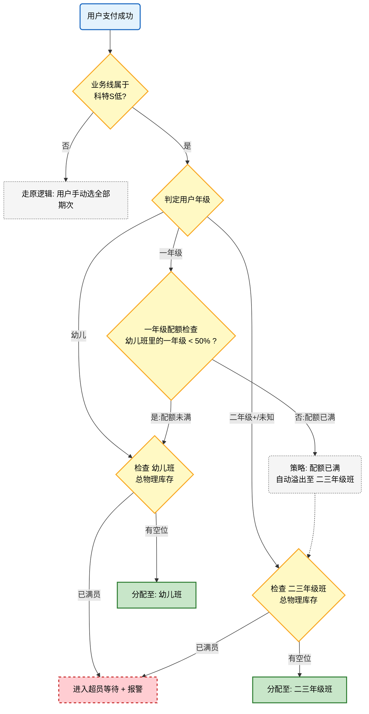

```mermaid
graph TD
    %% --- 1. 样式定义 (置顶以提高兼容性) ---
    %% 统一全黑文字 (#000000)
    classDef userStyle fill:#E3F2FD,stroke:#1565C0,stroke-width:2px,color:#000000;
    classDef logicStyle fill:#FFF9C4,stroke:#F9A825,stroke-width:2px,color:#000000;
    classDef actionStyle fill:#C8E6C9,stroke:#2E7D32,stroke-width:2px,color:#000000;
    classDef errorStyle fill:#FFCDD2,stroke:#C62828,stroke-width:2px,stroke-dasharray: 5 5,color:#000000;
    
    %% --- 2. 节点定义 (文字加引号修复渲染问题) ---
    Start("用户支付成功")
    
    %% 逻辑判断
    RegionCheck{"检查用户区域<br>是否属于指定名单?"}
    GradeCheck{"判定用户年级"}
    LoadBalance{"一年级分流策略<br>对比 A vs B 满班率"}

    %% 结果节点
    ToA_Low("分配至: A学期 - 低幼班")
    ToB_Region("分配至: B学期 - 区域班")
    ToB_Grade("分配至: B学期 - 年级班")

    %% 异常节点
    Waitlist["进入等待队列 / 人工协调"]

    %% --- 3. 连线逻辑 ---
    %% 支付 -> 区域判定
    Start --> RegionCheck

    %% 区域判定逻辑
    RegionCheck -- "是 (指定区域)" --> ToB_Region
    RegionCheck -- "否 (非指定)" --> GradeCheck

    %% 年级判定逻辑
    GradeCheck -- "低幼" --> ToA_Low
    GradeCheck -- "二年级及以上" --> ToB_Grade
    GradeCheck -- "一年级" --> LoadBalance

    %% 负载均衡逻辑
    LoadBalance -- "策略: A学期较空" --> ToA_Low
    LoadBalance -- "策略: B学期较空" --> ToB_Grade

    %% 兜底逻辑
    ToA_Low -.-> Waitlist
    ToB_Region -.-> Waitlist
    ToB_Grade -.-> Waitlist

    %% --- 4. 样式绑定 ---
    class Start,ToA_Low,ToB_Region,ToB_Grade userStyle;
    class RegionCheck,GradeCheck,LoadBalance logicStyle;
    class Waitlist errorStyle;
```

```mermaid
graph TD
    %% --- 1. 样式定义 (强制黑字 + 高对比度) ---
    %% 蓝色系：起点/终点 (背景淡蓝，边框深蓝，字纯黑)
    classDef userStyle fill:#E3F2FD,stroke:#1565C0,stroke-width:2px,color:#000000;
    
    %% 黄色系：逻辑判断 (背景淡黄，边框深黄，字纯黑)
    classDef logicStyle fill:#FFF9C4,stroke:#F9A825,stroke-width:2px,color:#000000;
    
    %% 绿色系：正向结果 (背景淡绿，边框深绿，字纯黑)
    classDef actionStyle fill:#C8E6C9,stroke:#2E7D32,stroke-width:2px,color:#000000;
    
    %% 红色系：异常/报警 (背景淡红，边框深红，字纯黑)
    classDef errorStyle fill:#FFCDD2,stroke:#C62828,stroke-width:2px,stroke-dasharray: 5 5,color:#000000;
    
    %% 灰色系：辅助流程 (背景淡灰，边框深灰，字纯黑)
    classDef noteStyle fill:#F5F5F5,stroke:#616161,stroke-width:1px,stroke-dasharray: 2 2,color:#000000;

    %% --- 2. 节点定义 ---
    Start(用户支付成功)
    BizCheck{业务线属于<br>科特S低?}
    OldLogic[走原逻辑: 用户手动选全部期次]
    
    GradeCheck{判定用户年级}
    
    %% 核心判断节点
    QuotaCheck{一年级配额检查<br>幼儿班里的一年级 < 50% ?}
    StockCheckA{检查 幼儿班<br>总物理库存}
    StockCheckB{检查 二三年级班<br>总物理库存}
    
    %% 动作节点
    ToA[分配至: 幼儿班]
    ToB[分配至: 二三年级班]
    ToWait[进入超员等待 + 报警]
    Overflow(策略: 配额已满<br>自动溢出至 二三年级班)
    
    %% --- 3. 连线逻辑 ---
    
    %% 业务线网关
    Start --> BizCheck
    BizCheck -- 否 --> OldLogic
    BizCheck -- 是 --> GradeCheck
    
    %% 年级分流
    GradeCheck -- 幼儿 --> StockCheckA
    GradeCheck -- 一年级 --> QuotaCheck
    GradeCheck -- 二年级+/未知 --> StockCheckB
    
    %% 一年级配额逻辑 (核心变更点)
    QuotaCheck -- 是:配额未满 --> StockCheckA
    QuotaCheck -- 否:配额已满 --> Overflow
    Overflow -.-> StockCheckB
    
    %% 幼儿班总库存检查 
    %% (注：幼儿无需看配额，因为一年级被限制在50%，剩下的50%必然属于幼儿)
    StockCheckA -- 有空位 --> ToA
    StockCheckA -- 已满员 --> ToWait
    
    %% 二三年级班库存检查 (兜底)
    StockCheckB -- 有空位 --> ToB
    StockCheckB -- 已满员 --> ToWait

    %% --- 4. 样式绑定 ---
    class Start,ToA,ToB userStyle;
    class BizCheck,GradeCheck,QuotaCheck,StockCheckA,StockCheckB logicStyle;
    class ToWait errorStyle;
    class Overflow,OldLogic noteStyle;
    class ToA,ToB actionStyle;
```

