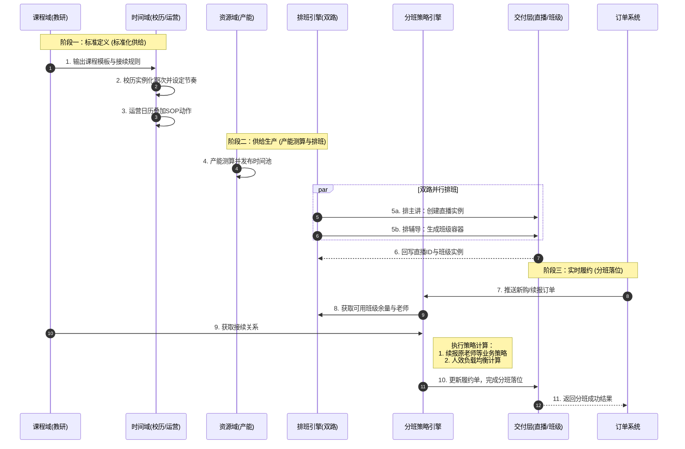

    
    
         

```mermaid
sequenceDiagram
    autonumber
    participant 教研 as 课程域(教研)
    participant 时间 as 时间域(校历/运营)
    participant 资源 as 资源域(产能)
    participant 排班 as 排班引擎(双路)
    participant 策略 as 分班策略引擎
    participant 交付 as 交付层(直播/班级)
    participant 订单 as 订单系统

    Note over 教研, 时间: 阶段一：标准定义 (标准化供给)
    教研->>时间: 1. 输出课程模板与接续规则
    时间->>时间: 2. 校历实例化期次并设定节奏
    时间->>时间: 3. 运营日历叠加SOP动作 
    Note over 资源, 排班: 阶段二：供给生产 (产能测算与排班)
    资源->>资源: 4. 产能测算并发布时间池     
    par 双路并行排班
        排班->>交付: 5a. 排主讲：创建直播实例
        排班->>交付: 5b. 排辅导：生成班级容器
    end
    交付-->>排班: 6. 回写直播ID与班级实例

    Note over 订单, 交付: 阶段三：实时履约 (分班落位)
    订单->>策略: 7. 推送新购/续报订单 
    策略->>排班: 8. 获取可用班级余量与老师 
    教研->>策略: 9. 获取接续关系
    
    Note right of 策略: 执行策略计算：<br/>1. 续报原老师等业务策略<br/>2. 人效负载均衡计算 
    
    策略->>交付: 10. 更新履约单，完成分班落位
    交付-->>订单: 11. 返回分班成功结果
```      
    
    
    
    
   