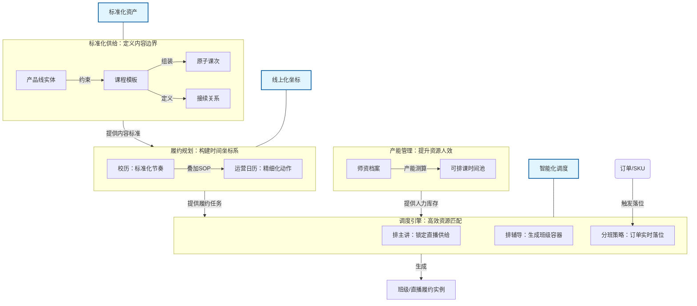
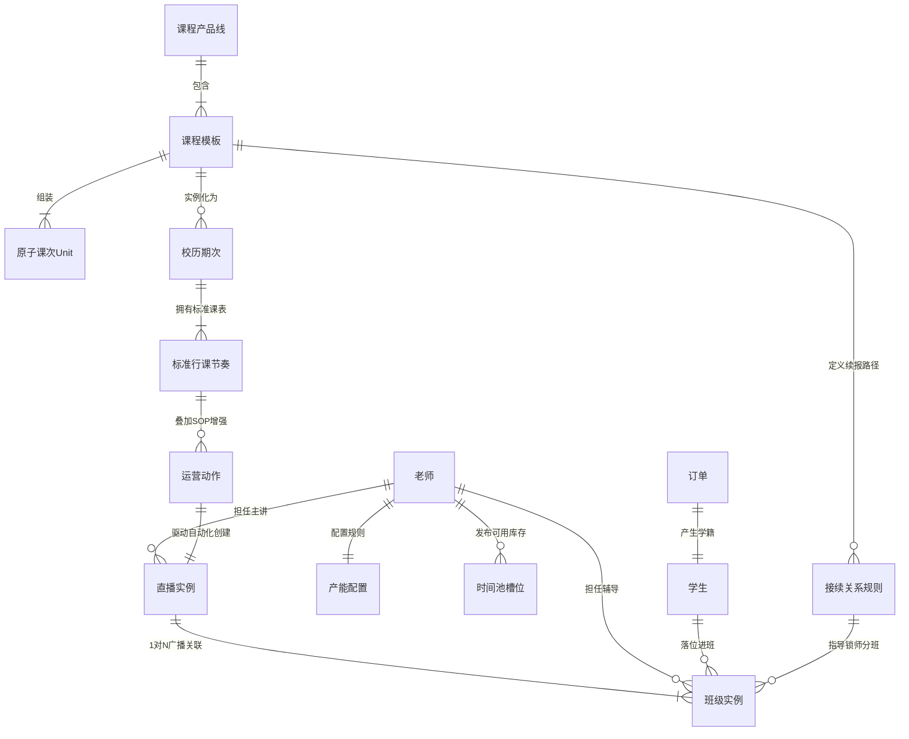

```mermaid
graph TD
    %% 定义样式
    classDef domain fill:#f9f9f9,stroke:#333,stroke-width:2px,stroke-dasharray: 5 5;
    classDef entity fill:#fff,stroke:#333,stroke-width:1px;

    %% 课程域
    subgraph ResearchDomain [课程域：标准化供给]
        direction TB
        A1[课程产品线] --- A2[课程模板]
        A2 --- A3[原子课次Unit]
        A2 --- A4[接续关系规则]
    end

    %% 时间域
    subgraph TimeDomain [时间域：履约节奏]
        direction TB
        B1[校历期次] --- B2[标准行课节奏]
        B2 --- B3[运营动作SOP]
    end

    %% 资源域
    subgraph ResourceDomain [资源域：产能资源]
        direction TB
        C1[老师] --- C2[产能配置]
        C1 --- C3[时间池槽位]
    end

    %% 交付域
    subgraph DeliveryDomain [交付域：执行与连接]
        direction TB
        D1[直播实例]
        D2[班级实例]
        D3[学生]
    end

    %% 跨域关联 (逻辑连线)
    A2 ==>|实例化| B1
    B3 -.->|驱动创建| D1
    C1 ---|主讲| D1
    C1 ---|辅导| D2
    D1 ---|1对N关联| D2
    D3 ---|落位进班| D2
    A4 -.->|指导分班| D2


